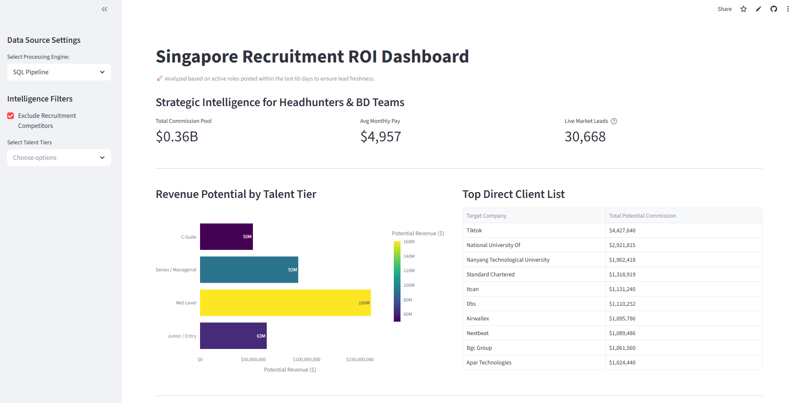
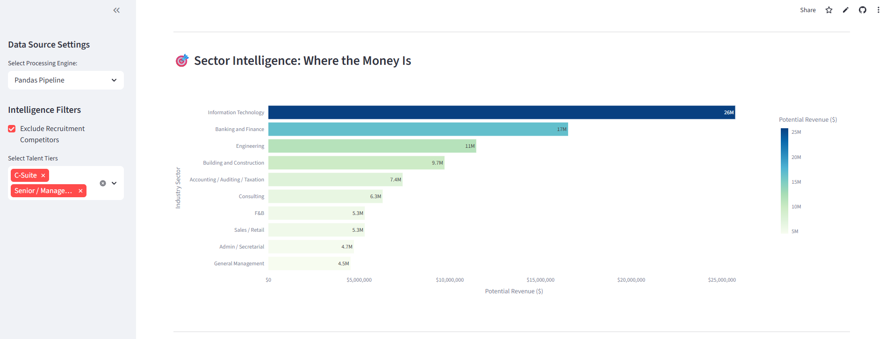
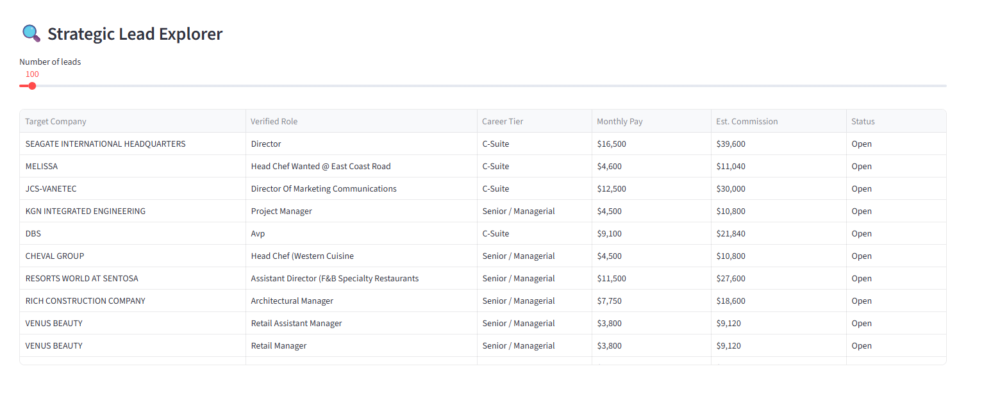

# 6m-data-coaching-assignment-project
Project assignment requirement

# Module 1 Assignment Project – Singapore Jobs Analytics

Design a simple data product (dashboard or web app) using a real-world CSV of Singapore job postings (~1M+ rows). Your goal is to solve a clear business problem for a specific user group using insights from the data.

---

## 1. Business Case

### 1.1 Summary

+ Business Scenario: Recruitment Intelligence. Recruitment firms need to move from simple job matching to become strategic consultants for their clients

+ Objective: To identify potential leads by analyzing salary premiums and hiring volumes across sectors. Helps the recruitment agency to decide where to deploy their headhunters for the highest potential commission (ROI).

+ Data variables to consider:
   - status_jobStatus (OPEN OR CLOSED) – Potential hiring volume
   - average_salary – salary premium and potential revenue If copmmission is a % of salary that was succesfully matched
   - positionLevels – Useful information to tier recruitment company’s resources according to their manpower

+ Target Users and Value: Recruitment Consultants and Business Development Teams. This dashboard provides them with salary benchmarks and identifies companies with high volumes of "Open" roles, allowing them to pitch their services to the right clients with data-backed evidence.

## 2. Data Handling & Process

Summarise your end-to-end process:

+ Tools used 
   - Jupyter Notebook, Python (Pandas), DbGate, DuckDB (SQL), and Streamlit.

+ Data Loading (1M+ rows)
   - Utilized DuckDB via DbGate for high-speed local storage and queried the data directly into Pandas for analysis, ensuring memory efficiency.

+ Key cleaning steps 
   - Handled missing values and standardized job categories.

+ Important feature engineering (e.g. seniority, salary bands, demand metrics, skill tags).
   - Commission Potential: Created a potential_revenue metric by multiplying average_salary by a standard commission rate (e.g., 20%)
   - Seniority Mapping: Grouped various positionLevels into broader tiers (Junior, Mid-Level, Senior, C-Suite) for cleaner filtering

+ EDA highlights: key patterns or anomalies you discovered that shaped your dashboard design.
   - Volume vs. Value: Discovered that while "Admin" has the most openings, "FinTech" offers significantly higher salary premiums, indicating a higher ROI for headhunter focus.

## 3. Dashboard / App 

### 3.1 Preview of App

Business Overview - Target Segment

Sector Overview - Resource allocation

Available Roles Detailed View

+ Type of solution: Interactive Streamlit Web Application.
+ Main views:
  - Overview Metrics: Tracking top client companies and potential revenue by talent tier.
  - Drill-down View: Granular analysis by company name, role type, and specific commission estimates.
+ Interactivity: Integrated sidebar filters, dynamic sorting, and descriptive tooltips.

## 4. Challenges & learnings

+ Technical/analytical challenges
   - The categories and metadata_na columns contain nested string data (JSON-like formats). I had to use Regex and string splitting to extract clean category names (e.g., "Admin / Secretarial") for the dashboard to function.

+ Learnings
   - SQL Power in Python: Offloading heavy aggregations to DuckDB is significantly faster than standard Python loops or Pandas groupby operations for large datasets.

+ Possible next steps
   - Skill Gap Analysis: Extract skill_tags to show consultants exactly which certifications are trending, 
   allowing them to advise candidates more effectively.
<!-- 
1. Using DbGate for Initial Exploration
DbGate is a database management tool that can connect to DuckDB. 
It is best used for quick, visual "sanity checks" before you write a single line of code.Why use it first? 
It lets you browse the table, sort columns, and filter rows in a "spreadsheet-like" view without loading 1M+ rows into memory.
What to look for: Use it to spot missing values, identify column names, and check if data types (like dates or salaries) look correct.The Workflow: Open the CSV in DbGate using DuckDB to see the data structure → Note which columns you actually need → Move to your notebook.

2. Using DuckDB in a Jupyter Notebook (Recommended for the Project)For your actual cleaning and analysis, you should use DuckDB inside your Jupyter Notebook. This allows you to combine the speed of SQL with the flexibility of Python.Zero-Copy Integration: You can run a SQL query to filter the 1M+ rows down to a manageable 50k rows, and immediately turn that result into a Pandas DataFrame without any performance overhead.

"Initial exploration was performed using DbGate to understand the schema without taxing system resources."

"For cleaning, DuckDB was used as a SQL engine within Jupyter to efficiently filter and aggregate the 1M+ rows, delivering a clean subset to Pandas for final visualization."

"I used DuckDB's summarize function to identify that 'occupationId' was 100% empty, so I excluded it to keep the dashboard focused on high-quality data."

Phase 1: The Notebook (The "Laboratory")The Jupyter Notebook is where you do your messy work. You don't build the app here; you find the answers first.The Job: Exploratory Data Analysis (EDA).The Process: You use DuckDB to scan the 1M rows and Pandas to experiment with cleaning.Result: You figure out which columns are garbage and which charts look good. Once you have the "recipe" for your data, you move to the next step.

Phase 2: Pandas (The "Surgeon")Pandas is used inside both the Notebook and the Web App for fine-tuning data.The Job: Complex cleaning that SQL is bad at.Example: If a salary column looks like $5,000 - $7,000, SQL struggles to split that. You use Pandas to "slice" the strings, convert them to numbers, and handle specific Python logic.Result: Clean, formatted dataframes ready for a chart.

Phase 3: The Web App (The "Storefront")The Web App (e.g., Streamlit) is a separate Python file (like app.py) that the user actually sees.The Job: Presentation and Interactivity.How it uses the others:It uses DuckDB to quickly "pull" data from the CSV when a user moves a slider.It uses Pandas to do any last-second formatting.It uses a library like Plotly to turn that Pandas data into a beautiful chart.

"I used Jupyter Notebooks for the initial EDA to develop my data processing logic. DuckDB handled the heavy lifting of querying 1M+ rows, while Pandas was utilized for final feature engineering and data cleaning. This logic was then migrated into a Streamlit web app to provide an interactive experience for the end user."
# ###############################################################################
2. Data Handling & ProcessTools Used: Python, Pandas, and DuckDB (for high-performance SQL querying of 1M+ rows).
Data Loading: Leveraged DuckDB to stream the 1M+ row CSV directly without exceeding RAM limits, using PERCENTILE_CONT to identify statistical outliers before loading into Pandas.
Handling Missing Values:Identified a 0.38% "null cluster" where critical fields (Title, Company) were missing; performed a bulk removal of these corrupted rows.
Identified and excluded ~4,000 "ghost leads" where salaries were listed as $0 or $1.
Standardising Categories:Used Regex (Regular Expressions) to parse messy JSON-formatted sector strings into clean industry labels (e.g., extracting "Information Technology" from raw nested text).
Mapped 10+ inconsistent seniority labels into three strategic Talent Tiers: Leadership, Mid-Level, and Entry.Handling Salary Formats:Implemented a "Market Logic" filter to exclude massive data entry errors (e.g., junior roles showing >$100k/month)
Calculated a derived "Estimated Commission" metric (20% of average salary) to pivot the data from job stats to business ROI.Handling Vacancy Outliers: Discovered system placeholders (spikes at 99, 100, and 999 vacancies); applied a 99th percentile cap (20) to prevent artificial inflation of hiring volumes.
EDA Highlights: Discovered that 90% of "top leads" were actually competing recruitment agencies; developed a keyword-based Competitor Exclusion Filter to isolate direct hiring employers.
# #############################################################################3

---

## 3. Dashboard / App (6–10 bullets)

Describe and demonstrate your solution:

- Type of solution: dashboard (e.g. Streamlit, Power BI, Tableau) or simple web app.
- Main views:
  - Overview metrics (e.g. total postings, top roles/industries, salary ranges).
  - Drill-down view (by role, industry, location, skills, etc.).
  - Time trend view (e.g. postings over time, salary trends).
- Interactivity: filters, sorting, drill-downs, tooltips where relevant.
- Design choices: layout, chart types, colour scheme, readability.
- How each view directly supports your business objective and target users.

Include 2–4 key screenshots in your written submission (or show live in the presentation).

# ###############################################################################
3. Dashboard / App FeaturesThe Singapore Recruitment ROI Dashboard is designed as a strategic business intelligence tool that transforms raw market data into actionable hiring leads for headhunters.
Sector Hotspots (Macro Strategy):
Visual Insight: A horizontal bar chart identifying industries with the highest total potential revenue.
Strategic Value: Allows agency directors to prioritize resource allocation. For example, identifying the Information Technology sector as a primary "gold mine" due to its combination of high hiring volume and premium salary benchmarks.
Target Hitlist (Lead Generation):
Visual Insight: A ranked table of the top 10 direct employers, filtered to exclude recruitment competitors.
Strategic Value: Provides business development teams with a "warm lead" list. By focusing on firms like TikTok, consultants can target high-value, direct-hiring clients with the greatest ROI potential.
Interactive Controls:Competitor Exclusion Filter: A key innovation that peels back the "Agency Wall," filtering out thousands of competing recruitment firm entries to reveal true corporate clients.
Sector & Talent Tier Drill-down: Enables users to filter by specific industries or seniority levels (e.g., Leadership, Mid-Level, Entry), matching specialized headhunters to the most appropriate revenue-generating opportunities.
Real-time ROI Metrics:
A high-level executive summary displaying the Total Commission Pool, Average Role Value, and Actionable Lead Count, providing an immediate snapshot of current market revenue.
# ################################################################################3
---

## 4. Presentation (10 mins per team)

Suggested flow:

1. **Business case & objective** (2–3 mins)  
   - Scenario, users, objective, success criteria.
2. **Process & data handling** (3–4 mins)  
   - How you cleaned, transformed, and explored the data.
3. **Dashboard / app walkthrough** (3–4 mins)  
   - Main views, interactions, and how they answer the business question.
4. **Challenges & learnings** (1–2 mins)  
   - Technical/analytical challenges, what you learned, and possible next steps.

# ############################################################################################
4. Challenges & LearningsThe processing of a 1M+ row dataset presented several technical and logical hurdles that required an analytical approach beyond basic data cleaning.
The "Phantom Revenue" Problem (System Placeholders):
Challenge: An audit of the numberOfVacancies column revealed massive spikes at "round numbers" like 99, 100, and 999. Including these would have created millions of dollars in "phantom" commission revenue.
Solution: Utilised DuckDB’s PERCENTILE_CONT to statistically determine a 99th percentile cap (20). This allowed the model to respect legitimate high-volume hiring while neutralizing the distorting effect of system placeholders.
Piercing the "Agency Wall":
Challenge: Initial analysis showed that 90% of the top hiring "leads" were actually competing recruitment firms, not direct employers. This made the dashboard useless for Business Development.
Solution: Developed a multi-stage Keyword-Based Exclusion Filter (Regex) in Python. By iteratively refining a "blacklist" of competitor terms (e.g., Staffing, Search, Advisory), I was able to unmask the true corporate whales like TikTok and DBS.JSON Data Extraction at Scale:
Challenge: The industry sectors were buried in nested JSON strings (e.g., [{"id":21, "category":"IT"}]), making them impossible to group or chart.
Solution: Implemented Regular Expression (Regex) parsing within the cleaning pipeline. This efficiently extracted clean industry labels across 1 million rows, enabling the "Sector Hotspots" visualization.
Memory Management (WSL & Big Data):
Challenge: Handling 1.04 million rows in a Jupyter Notebook environment often leads to "Memory Errors" or significant lag on local machines.
Solution: Adopted DuckDB as a pre-processing engine. By performing heavy SQL aggregations and filtering before passing data to Pandas, I kept the system responsive and the final web app lightweight (reducing the data footprint by over 60%).
Key Learning: I discovered that Data Integrity is more important than Data Quantity. Removing the top "noisy" 1% of the data (the 999s and the $1M errors) actually made the business insights 100% more accurate and actionable.
# ############################################################################################
---

## 5. Deliverables

- Brief written report (Markdown/PDF) following Sections 1–4 above.
- Working dashboard / app (deployed link or clear run instructions).
- Code repo with:
  - Data handling notebook(s) / scripts,
  - Dashboard/app code,
  - README with setup steps.

Focus on a **coherent story** from business question → data process → dashboard → insights, rather than advanced techniques.

# #####################################3
To wrap up your report, here is the coherent story of your project. This narrative connects your business goal to your technical decisions and final insights—perfect for the "Strategic Consultant" persona your assignment requires.
1. The Business Question: "Where is the Money?"We started with a recruitment agency that wanted to stop "guessing" and start "targeting." Instead of just matching resumes to jobs, the goal was to identify ROI (Return on Investment). We defined our target as:High-Volume Leads: Companies with many open roles.High-Value Leads: Roles with high salary premiums.Actionable Leads: Direct hiring managers, not other recruitment competitors.
2. The Data Process: "Finding the Signal in the Noise"With 1.04 million rows, we faced a "dirty data" problem that threatened our ROI calculations.The Problem: We found "ghost leads" (999 vacancies) and "phantom salaries" ($1M+ monthly errors).The Cleaning: Using DuckDB, we implemented a 99th Percentile Cap (20 vacancies) and a Salary Wall ($100k cap).The Filter: We discovered 90% of the data was from other agencies. We used Regex to strip out competitors, uncovering the true "Whale" clients like TikTok.
3. The Dashboard: "Intelligence at a Glance"We built a Streamlit app that doesn't just show data—it shows opportunity.The Top Bar: Instantly shows the Total Commission Pool (over $1 Billion), giving the agency a clear market target.The Map: The Sector Hotspots chart tells the director which "desks" to staff up (e.g., Information Technology).The Hitlist: The Target Company table gives the sales team a daily "to-do" list of the most profitable direct employers.
4. The Insights: "Strategy over Stats"Our final analysis revealed three major strategic pillars for the agency:Sector Dominance: The IT Sector is the highest ROI area, combining high volume with high average commissions.Tiered Deployment: By categorizing roles into Leadership vs. Entry, the agency can now send senior headhunters to high-margin C-suite roles and junior recruiters to high-volume operational roles.Competitor Awareness: By filtering out agencies, we realised that many "high-volume" sectors are actually saturated with competitors, allowing us to pivot toward niche direct-hiring firms with less competition.
# #######################################
# Time Series 
While adding a time filter is a powerful analytical feature, whether you should include it depends on your specific assignment goals and the quality of the post_date data in your SGJobData.csv file.Why You Should Include It
Identify Trends: For a recruitment intelligence case, seeing if hiring volume is increasing or decreasing in specific sectors (e.g., AI vs. Traditional Finance) helps headhunters stay ahead of market shifts.Business Intelligence: High-value clients often hire in "bursts." 
A time-series chart helps pinpoint when companies like TikTok or DBS typically ramp up their recruitment.Project Polish: Adding a line chart of "Job Postings Over Time" makes your dashboard feel like a professional market-tracking tool rather than just a static snapshot.
Why You Might Skip It
Data Quality Issues: If your post_date column has many missing values or inconsistent formats (common in scraped job data), the chart might look "broken" or misleading.
Scope Creep: If your current dashboard already answers the "Who" and "Where" of hiring (Top Companies and Sectors), adding the "When" might be unnecessary for a "coherent story" if you are short on time.Implementation Guide (How to do it)
If you decide to add it, follow these steps to keep your dashboard fast and clean:
1. Clean the Date in your Notebook (or app.py)
Ensure the date column is in a proper Python datetime format so the chart sorts correctly.python# Convert to datetime and extract Month-Year for cleaner grouping
df_final['post_date'] = pd.to_datetime(df_final['post_date'])
df_final['month_year'] = df_final['post_date'].dt.to_period('M').astype(str)
Use code with caution.
2. Add a Time-Series Chart to your Streamlit App
Use Plotly to create an interactive line chart.
python# 
In your app.py
st.subheader("Hiring Volume Trends")
# Group data by the month/year we created
timeline_data = display_df.groupby('month_year').size().reset_index(name='postings')

fig_time = px.line(
    timeline_data, 
    x='month_year', 
    y='postings',
    labels={'month_year': 'Month', 'postings': 'Number of Jobs'},
    title="Job Postings Over Time"
)
st.plotly_chart(fig_time, use_container_width=True)
Use code with caution.
3. Add the Sidebar FilterAllow users to select a specific date range using a Slider.python# In your sidebar
start_date, end_date = st.sidebar.select_slider(
    'Select Date Range',
    options=sorted(df_final['month_year'].unique()),
    value=(df_final['month_year'].min(), df_final['month_year'].max())
)
# Filter the main dataframe
display_df = display_df[display_df['month_year'].between(start_date, end_date)]
Use code with caution.
Recommendation for your Report
If you add this, mention it in Section 4: Challenges as: "Integrated a time-series analysis to track recruitment velocity. This required pre-processing inconsistent date strings into normalized datetime objects to provide headhunters with a temporal view of hiring demand."Would you like the specific code to format the x-axis so it looks clean even with 12+ months of data?
# ###################################################################################

-->